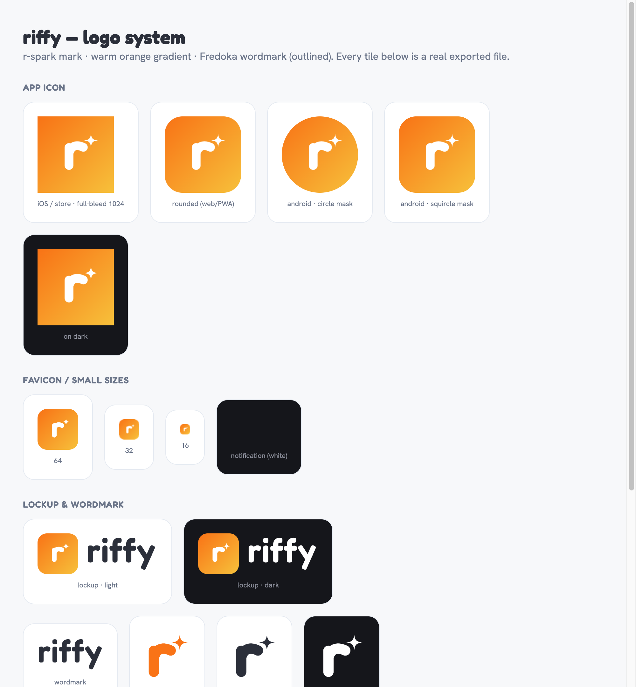

# riffy — logo & brand mark

The **r-spark** mark: a soft lowercase **r** with a **spark** — the quick, clever spark of
wit. Built for *social wit · humour · quickness · improv*, tuned warm and friendly for the
anxious-introvert persona ("never loud, never childish"). Self-contained vector (no font or
network needed); the wordmark is the **Fredoka 600** "riffy" converted to outlines.



## Brand basics
| | |
|---|---|
| **Gradient** | `linear-gradient(135deg, #F97316 → #F7C13B)` (warm orange) |
| **Ink** | `#2B2F3A` (mono black) · `#FFFFFF` (mono white) |
| **Solid accent** | `#F97316` |
| **Display / wordmark** | Fredoka 600 |
| **Icon corner radius** | 23 % (squircle) |
| **Clear space** | keep ≥ ½ the mark's height clear on all sides |

## Source files — `svg/` (edit these; everything else is generated)
| File | Use |
|---|---|
| `riffy-icon.svg` | App icon, **rounded** corners + transparent outside — web / PWA / in-page |
| `riffy-icon-fullbleed.svg` | App icon, **square & opaque** — iOS/Android store source & maskable |
| `riffy-mark.svg` / `-white` / `-black` | Glyph only (no tile), three colors |
| `riffy-wordmark.svg` / `-white` | "riffy" outlined wordmark |
| `riffy-lockup.svg` / `-white` | Icon + wordmark, horizontal |
| `riffy-adaptive-foreground.svg` | Android adaptive **foreground** (glyph in 66dp safe zone) |
| `riffy-adaptive-background.svg` | Android adaptive **background** (gradient) |
| `riffy-notification.svg` | Android status-bar icon (flat white silhouette) |
| `riffy-og.svg` | Social / link-preview card (1200×630) |
| `riffy-splash.svg` | Launch screen (2732×2732) |

## Generated PNGs — `png/`
- **App icon:** `icon-1024 / 512 / 256 / 192 / 180 / 167 / 152 / 120.png` (full-bleed, opaque)
- **Rounded / favicons:** `icon-rounded-512.png`, `favicon-32.png`, `favicon-16.png`
- **PWA maskable:** `maskable-512.png`
- **Android adaptive:** `adaptive-foreground-432.png`, `adaptive-background-432.png`
- **Notification:** `notification-96.png` (white on transparent — looks blank on white, that's correct)
- **Marks:** `mark-512.png`, `mark-white-512.png`, `mark-black-512.png`
- **Wordmark:** `wordmark-1024.png`, `wordmark-white-1024.png`
- **Lockup:** `lockup-1200.png`, `lockup-white-1200.png`
- **Social / splash:** `og-1200x630.png`, `splash-2732.png`

## Regenerate the PNGs
```bash
bash export.sh        # renders everything in svg/ → png/ via headless Chrome
```
Favicons 16/32 are downscaled from the 512 with `sips` (Chrome won't render windows that tiny).

## Wiring into the app (Capacitor)
- iOS / Android icons + splash: feed `riffy-icon-fullbleed.svg` (or `icon-1024.png`) and
  `riffy-splash.svg` to **@capacitor/assets** (`npx @capacitor/assets generate`). Use the two
  `adaptive-*` files for the Android adaptive icon, and `riffy-notification.svg` for the
  status-bar icon.
- Web `index.html`: `favicon-32.png` / `favicon-16.png`, `icon-rounded-512.png` (apple-touch),
  and `maskable-512.png` (PWA manifest, `purpose: "maskable"`).
- Meta: `og-1200x630.png` for `og:image` / `twitter:image`.

## Other concepts (history)
`concepts.html`, `concepts-v2.html`, `concepts-v3.html` (+ PNGs) hold the earlier exploration —
soundwave bubble → spark bubble / smirk / spark → spark-buddy mascot. Kept for reference.
